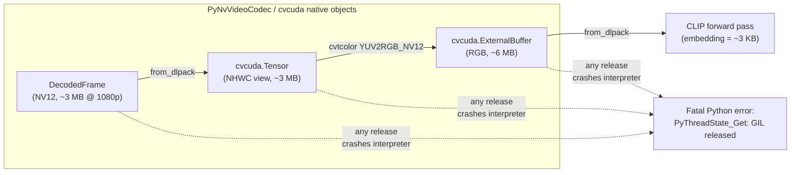
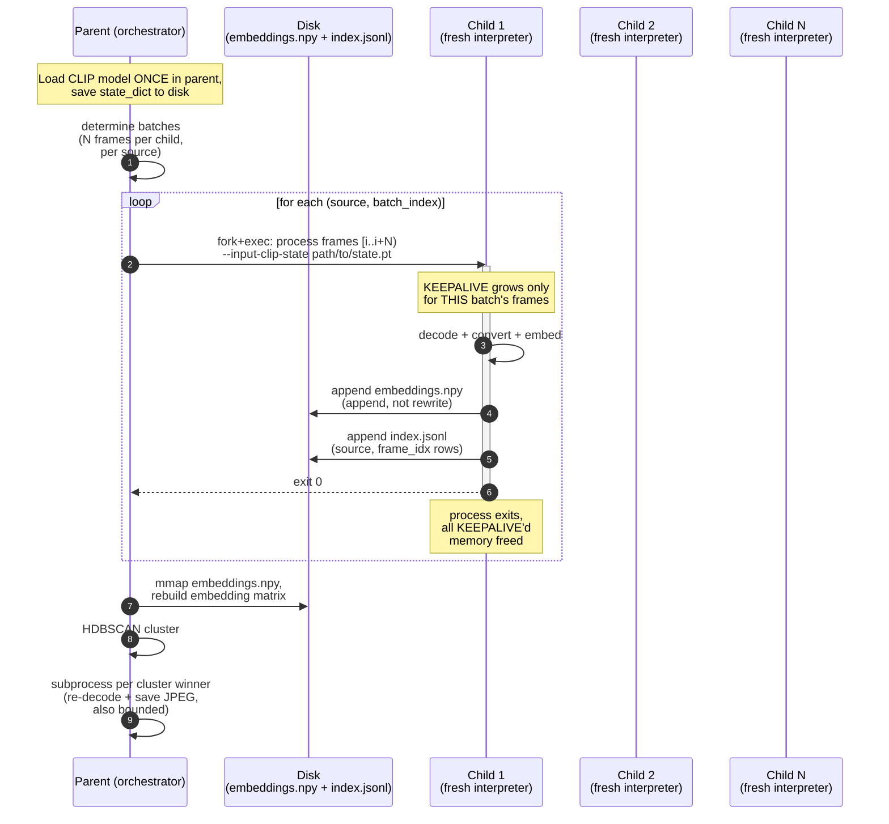
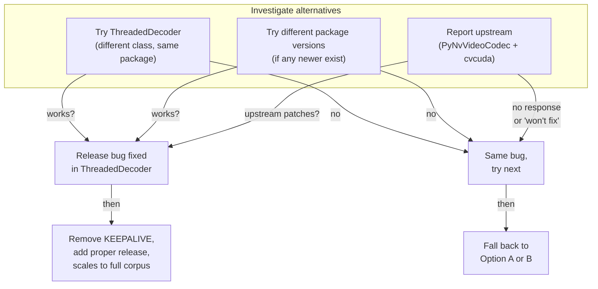
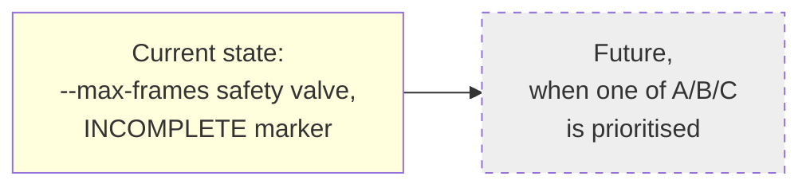

# Exhaustive-frame scaling options — architecture comparison

**Date:** 2026-09-02
**Trigger:** Discussion of whether the current `flay_video_exhaustive.py` design can actually scale to a multi-hour, multi-source corpus given the PyNvVideoCodec / cvcuda release-on-collect bug documented in `pynvvideocodec-feasibility.md` and `flay_video_exhaustive.py`'s module docstring.

## The shared constraint all four options inherit

The embedding itself is tiny (~3 KB / 768-dim float32). The crash happens only when the *pixel* intermediates are released, not when the embedding is touched. So the architectural question is: how do we get the embeddings to durable storage before the pixel buffers accumulate to VRAM limit?

**VRAM math** (RTX 3090, 24 GB, 1080p source):
- Per-frame pixel footprint in `KEEPALIVE`: ~18 MB (raw NV12 + cvcuda views + cvcuda ExternalBuffer for RGB)
- Single-process ceiling: ~24 GB ÷ 18 MB ≈ **1300 frames**, regardless of `--max-frames`
- Documented target corpus: 13 hours × ~24 fps = **~1.12M frames** per source
- Gap: **~860× over budget** for one source alone

The four options below all share the same upstream data path; they differ in **how and when VRAM pressure is relieved**.

## Option A — subprocess per batch (active code change)

**What changes:** introduce a parent script (`flay_video_exhaustive_orchestrator.py`?) that splits work into batches, spawns a child for each batch with a clean Python interpreter, and the child only holds *its own batch's* frames in `KEEPALIVE` before exiting. The parent concatenates the per-batch embedding shards and clusters.

**Properties:**
- Per-batch VRAM ceiling: 18 MB × batch_size (e.g. 100 frames = 1.8 GB — fits comfortably on 24 GB alongside CLIP)
- Corpus scale: bounded by disk, not VRAM
- Per-child runtime: 100 frames ≈ ~0.25s decode + 0.3s embed = <1s per child; with 1.12M frames = ~11000 children. Fork overhead (~10ms) is the bottleneck; ~2 min total orchestration overhead for a full corpus. Acceptable.
- Children share the CLIP model via a saved `state_dict` reloaded at child startup (~3s for ViT-L/14 weights). Or: keep CLIP loaded in parent and pass embeddings-only work to children (children do decode+convert only, parent batches and embeds). The latter is a smaller change.
- Clustering still runs once in the parent after all batches complete. If the corpus is so large that the full embedding matrix doesn't fit in RAM, that becomes the next bottleneck — but 1.12M × 768 floats = 3.4 GB, fine.
- **New failure surface:** child process management, embedding shard reassembly, partial-failure recovery (which batches completed?).

## Option B — just cap `--max-frames`, accept the bound

**What changes:** nothing in the script. Set `--max-frames 1300` (or compute dynamically from `torch.cuda.mem_get_info()`), document the cap as a hard ceiling, rename "exhaustive" → "denser-than-sparse" in the docstring.

**Properties:**
- Per-corpus VRAM ceiling: still 1300 frames total (single process, KEEPALIVE grows to ~24 GB at end)
- 1300 frames over 13 hours = 1 frame per ~36 seconds — *denser* than the sparse pipeline's 1 frame per 60 seconds, *not exhaustive*
- Clustering produces a useful keyframe set, just from a smaller sample
- The semantic claim "exhaustive" is wrong; honest name is "denser-sample" or "VRAM-bounded"
- Zero code change, zero new failure surface
- Honest about the upstream bug being unresolved; a reader of the docstring knows exactly what they're getting

## Option C — chase the upstream bug first

**What changes:** investigation work, not code. Try `PyNvVideoCodec.ThreadedDecoder` (different class, different buffer-lifetime semantics, untested so far). Try other package versions if newer exist. File an upstream report with the isolated repro (a 10-line script that crashes with a plain `keepalive = []` reassignment).

**Properties:**
- If any of the three work, Option A becomes unnecessary — proper per-frame release replaces `KEEPALIVE` and the script scales to full corpus with no architectural change
- If none work, fall back to Option A or B having spent the time with no code in hand
- Upstream response time is unbounded (could be days, could be never)
- Even if ThreadedDecoder has a different bug, you've ruled it out — useful information
- The branch author already noted in the docstring that this path is "not yet attempted" — no surprise content, just doing it

## Option D — defer, keep current state

**What changes:** nothing. Today's state — `flay_video_exhaustive.py` with `--max-frames`, `KEEPALIVE` docstring, `os._exit(0)`, the INCOMPLETE-marker smoke test — is honest about the bound.

**Properties:**
- No time spent, no new code, no new bugs
- The sparse-sampling `flay_video.py` continues to work for production keyframe extraction
- The exhaustive path is documented as a research/exploration direction, not a production capability
- Anyone reading the branch later gets the full story from the existing docstrings and feasibility doc

## Side-by-side

| Property | A: subprocess per batch | B: cap max-frames | C: upstream chase | D: defer |
|---|---|---|---|---|
| Breaks the VRAM ceiling | yes | no (still ~1300 frames/process) | depends on outcome | no |
| Corpus scale achievable | full (1.12M+ frames) | ~1300 frames / process | full if fix lands, else as A/B | n/a |
| Code change size | ~1-2 hours, new orchestrator script | zero | zero (investigation only) | zero |
| New failure surface | child lifecycle, shard reassembly, partial-failure recovery | none | none if reports ignored | none |
| Time to first useful result | ~half day to first end-to-end run | ~1 min (set a flag) | days/weeks (async) | already shipped |
| Honest about the bug | yes (architecture changes around it) | yes (caps it explicitly) | yes (cleared root cause) | yes (current state already documents it) |
| Reversible | yes (orchestrator is additive) | yes (just a flag value) | yes (no code touched) | yes (no code touched) |

## Recommendation shape

The four options aren't equally good — they optimize for different things:

- **Maximum corpus scale today:** Option A. The only path that breaks the VRAM ceiling with current packages.
- **Minimum code churn for an honest result:** Option B. Renames "exhaustive" to something true and moves on.
- **Lowest long-term risk:** Option C. If the upstream fix lands, all the workaround code becomes deletable. But the payoff is the most uncertain.
- **Cheapest pause point:** Option D. Current state is already documented and bounded.

A combined path is reasonable: **do B now** (set the cap, rename, document) to ship an honest bounded result, **start C in parallel** (file the upstream report — it's cheap and async), and **plan A for the future** when the upstream investigation either lands a fix (A becomes unnecessary) or comes back negative (A is needed).
