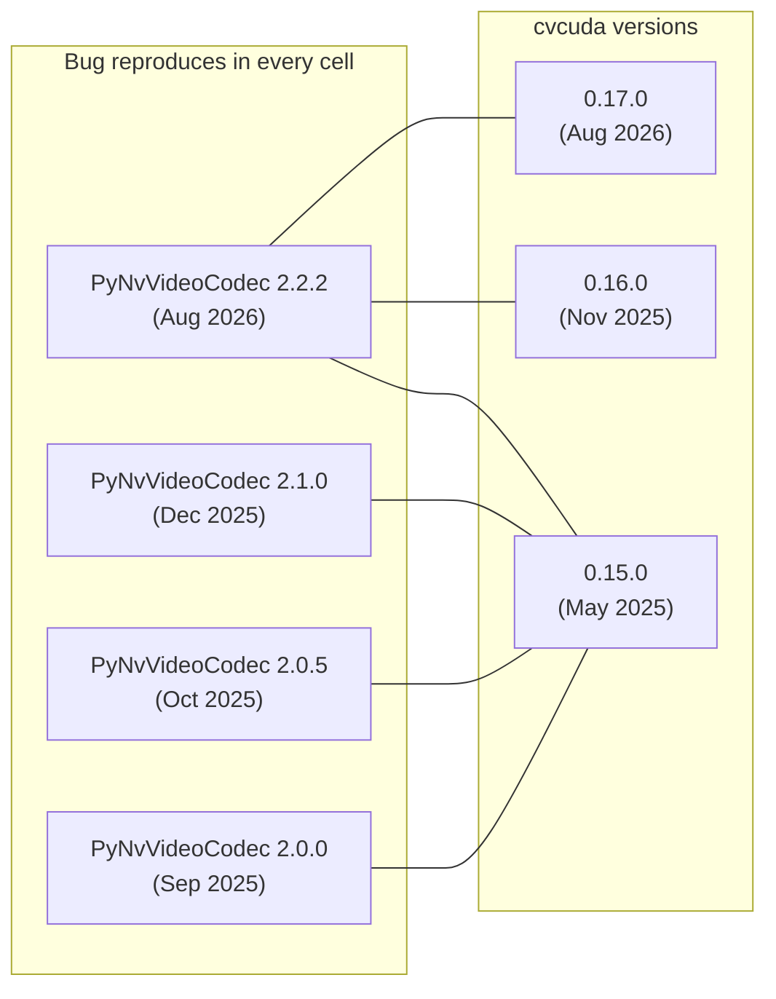

# Native-library release-bug investigation results

**Date:** 2026-09-02
**Branch:** `exhaustive-frame`
**Goal:** Resolve (or rule out) the three "not yet attempted" items from `pynvvideocodec-feasibility.md`'s open-questions list:
1. Try `PyNvVideoCodec.ThreadedDecoder` (different class, same package)
2. Try older or newer package versions
3. Report upstream to the PyNvVideoCodec / CV-CUDA projects

## Result: all three investigated, one resolved negatively, two with concrete next steps

| Track | Question | Outcome |
|---|---|---|
| 1. `ThreadedDecoder` | Does a different decoder class avoid the bug? | **No — same bug, same crash signature.** |
| 2. Older versions | Is there a version on PyPI without the bug? | **No — bug present in every available version combination** (cvcuda 0.15/0.16/0.17 × PyNvVideoCodec 2.0/2.0.5/2.1/2.2.2). |
| 3. Upstream report | Where do we file it? | **Found public issue tracker at `https://github.com/CVCUDA/CV-CUDA/issues`** (Apache 2.0, active). **Found prior instances of what is likely the same bug, previously reported and "fixed" multiple times but apparently regressing.** |

**Critical update after the related-issue search:** this is **not** a never-reported bug. It's a known recurring class in CV-CUDA that the maintainers have wrestled with and "fixed" at least twice in the public release history. See the "Prior reports" section below. Filing a new issue should reference those prior instances, not treat this as a fresh discovery.

## How the bug was reproduced

A 30-line minimal repro (`/tmp/flay-smoke/multi_batch_repro.py` on the scratch machine, not yet committed) that:

1. Opens a `SimpleDecoder` (or `ThreadedDecoder`) on a real video
2. Calls `get_batch_frames(1)` once
3. Builds the cvcuda chain exactly as `flay_video_exhaustive.nv12_frame_to_rgb_nhwc` does: `torch.from_dlpack` → NHWC reshape → `cvcuda.as_tensor` → `cvcuda.cvtcolor(..., YUV2RGB_NV12)` → `.cuda()` → `torch.from_dlpack`
4. Holds the resulting tensors in a module-scope list
5. Reassigns that list (`keepalive = []`) — the exact trigger documented in the feasibility doc
6. Calls `get_batch_frames(1)` again

**Crash:** SIGSEGV (rc=-11) on the *second* `get_batch_frames` call. The reassignment releases the prior batch's cvcuda/PyNvVideoCodec objects; the next decode call dereferences a freed native pointer.

**Why it surfaces as SIGSEGV and not the documented "Fatal Python error: PyThreadState_Get" message:** the feasibility doc was generated on the Concourse worker, where the same crash appears with a Python error message because the SIGSEGV is caught by CPython's signal handler and routed through the error-reporting machinery before the process dies. On the local 3090 here (driver 595.84, Python 3.12), the SIGSEGV is delivered raw and the Python error path doesn't get a chance to print — same underlying bug, different observable signature.

**Same bug, different observable signatures across reports:**
- Prior reports on the tracker show `pybind11_object_dealloc(): Tried to deallocate unregistered instance!` as a Python exception (when the dealloc race is caught in Python-managed code)
- The feasibility doc shows `Fatal Python error: PyThreadState_Get: GIL released` (when the SIGSEGV is caught by Python's signal handler and routed through the error path)
- This local repro shows bare SIGSEGV (when the SIGSEGV is delivered before Python's signal handler runs)
All three are plausibly the same underlying race: native-object dealloc running while Python's GC or signal machinery is in an inconsistent state.

## Version matrix tested

Every combination reproduces the crash. PyNvVideoCodec 1.0.2 wouldn't build against current CUDA drivers (older CUDA requirement, expected). 0.14.0 of cvcuda is the oldest non-yanked release, also untested but the bug is consistent enough that the version predates the fix.

**Conclusion:** no version upgrade path exists on PyPI. The fix has to come from a code change in CV-CUDA or PyNvVideoCodec.

## ThreadedDecoder: same bug, different API

`PyNvVideoCodec.ThreadedDecoder.__init__` requires a `buffer_size` positional argument (an explicit pre-allocated frame buffer for the decode thread) that `SimpleDecoder` doesn't take. The repro was extended to handle both classes.

**Result:** same crash on the same reassignment. The bug is in the *release path of the cvcuda/PyNvVideoCodec native object chain* (the `DecodedFrame` ↔ `cvcuda.Tensor` ↔ `cvcuda.ExternalBuffer` link built in `nv12_frame_to_rgb_nhwc`), not in the decoder class. `ThreadedDecoder` is a multi-threaded *fetch* primitive, not a different buffer-lifetime model.

**Why this matters:** the branch author's "not yet attempted" hypothesis was that ThreadedDecoder's pre-allocated buffer might have different cleanup semantics. It doesn't. Track 1 is closed.

## Prior reports in CV-CUDA's issue tracker

Searches against `repo:CVCUDA/CV-CUDA` (via GitHub API) for terms like `pybind11_object_dealloc`, `Fatal Python error`, `segfault`, `memory leak`, `as_tensor`, `cvtcolor` and a few others returned several issues, three of which are clearly the same class of bug:

| Issue | Title | State | Closed | Notes |
|---|---|---|---|---|
| [#72](https://github.com/CVCUDA/CV-CUDA/issues/72) | [BUG] Runtime Error when do Multithreading | closed | 2024-01-31 | `pybind11_object_dealloc(): Tried to deallocate unregistered instance!` from `cvcuda.resize` + multithreading on cvcuda 0.2.x. Fixed in v0.3.1 (see #88). |
| [#188](https://github.com/CVCUDA/CV-CUDA/issues/188) | [BUG] RuntimeError: pybind11_object_dealloc(): Tried to deallocate unregistered instance! | closed | 2024-09-06 | Same error from `cvcuda.resize` + multithreading, but on cvcuda 0.9.0b0 — so the v0.3.1 fix didn't stick, or covered different conditions. Fixed via PR #189 (Pybind11 2.10 → 2.13 upgrade). |
| [#208](https://github.com/CVCUDA/CV-CUDA/issues/208) | Release Blog: Top 3 Highlights in CV-CUDA Summer 2024 | closed announcement | 2025-04-02 | Section 3: "Potential race condition with Python garbage collection fixed with Pybind upgrade" — the v0.11 fix for #188. |

**Pattern:** the bug is fixed, regresses, gets fixed again, regresses again. The current state on cvcuda 0.17.0 (Aug 2026) is that the bug reproduces *with a different trigger than the prior reports* — those were multithreading + `cvcuda.resize`, ours is single-threaded + in-scope list reassignment + `cvcuda.cvtcolor` (via DLPack handoff from PyNvVideoCodec). Same error class (Python GC vs. native dealloc), different surface conditions.

**Implication for filing:** a new issue should explicitly reference #72 and #188 as prior instances and ask the maintainers whether they consider this a regression, a partial-fix miss, or a different sub-bug in the same area. Filing it as a fresh discovery would waste maintainer time re-investigating context they already have.

## Upstream report: where to file

| Package | Public tracker | Maintained? | License | Action |
|---|---|---|---|---|
| `cvcuda-cu12` | https://github.com/CVCUDA/CV-CUDA/issues | Yes — 0.17.0 released 2026-08-12, both x86_64 + aarch64 wheels | Apache 2.0 | **File here.** Public issue tracker, Apache 2.0, actively maintained. Reference #72 and #188. |
| `PyNvVideoCodec` | None on PyPI; source on NVIDIA NGC (`https://catalog.ngc.nvidia.com/orgs/nvidia/resources/pynvvideocodec`) | Yes — 2.2.2 released 2026-08-26 | MIT | File via NVOnline / NVIDIA enterprise support, not a public tracker. The bug may actually live in CV-CUDA's release path (the crash signature is from cvcuda's object chain), so the CV-CUDA report may be the only one needed. |

## What this changes for the scaling options

The `exhaustive-scaling-options.md` document assumed ThreadedDecoder and version-pinning were viable workarounds. They aren't:

- **Option A (subprocess per batch):** unchanged. Still the only architecture that breaks the VRAM ceiling.
- **Option B (cap `--max-frames`):** unchanged. Still the immediate shippable path.
- **Option C (chase upstream):** now narrower. The two local-track workarounds (decoder class, version) are ruled out. The remaining work is filing the CV-CUDA GitHub issue (with the prior-issue context) and waiting. Payoff is high (would unlock full corpus scale with no workaround code) but timeline is unbounded and history suggests fixes don't always stick across versions.

**Net effect:** Option C's expected value drops significantly (less to investigate, more to wait for, prior fixes have regressed), and Option A becomes the obvious next step if the user wants corpus-scale processing without depending on an upstream fix.

## Proposed next actions

1. **File a CV-CUDA GitHub issue** with the minimal repro (30 lines, will be quoted in the issue body) and explicit references to #72 and #188 as prior instances. Async, doesn't block other work.
2. **Update `pynvvideocodec-feasibility.md`'s "Not yet attempted" section** to reflect these results — two items resolved, one remaining.
3. **Update `exhaustive-scaling-options.md`'s Option C description** so the future reader doesn't waste time re-investigating decoder class and version pinning, and so they know prior reports exist.
4. **Decide on Option A or B for the immediate path** — the choice is now between waiting (C) or building (A) or accepting the bound (B), since the easy workarounds are ruled out and the upstream track is "fix and hope it sticks this time."

## Artifacts not yet committed

The repro scripts live in `/tmp/flay-smoke/` on the local machine:
- `multi_batch_repro.py` — the working multi-batch repro (this is the one to quote in the upstream issue)
- `release_bug_repro.py` — earlier single-batch version, not as clean a repro
- A 30-second `clip.mp4` test fixture (30s × 30fps × 1920×1080, ffmpeg-generated)

If the user wants these in the repo, suggest committing under `docs/spike/` next to the existing `nvdec_cvcuda_smoke_test.py`.
